# Bevezetés

Az emberek és állatok kapcsolata már ősidók óta megfigyelhető volt. 

Most viszont a 21. században,
mikor az emberek az eddiginél legtávolabb vannak a természettől, így az állatvilágtól is próbálják,
minél közelebb hozni a természetet magukhoz.

Munkánk végterméke lényegében erről is szól. A
Petfluencer jelenség arról szól, hogy nem magunkat mutatjuk a közösségi médián, hanem a
kisállatainkat.

Feladatunk egy Petfluencer webapplikáció elkészítése, mivel a csapatunk tagjai a React technológia
mellett döntöttek a többi lehetőség közül. 

A backed egy Google által fejlesztett BaaS (Backend-as-a-
Service) platform a Firebase. Ez előnyös mert meggyorsíthatja a fejlesztési folyamatot későbbiekben
skálázhatóságot biztosít, valamint a Google mérnökei és cégmérete miatt megbízhatóságot ad.

## Esetdiagramm

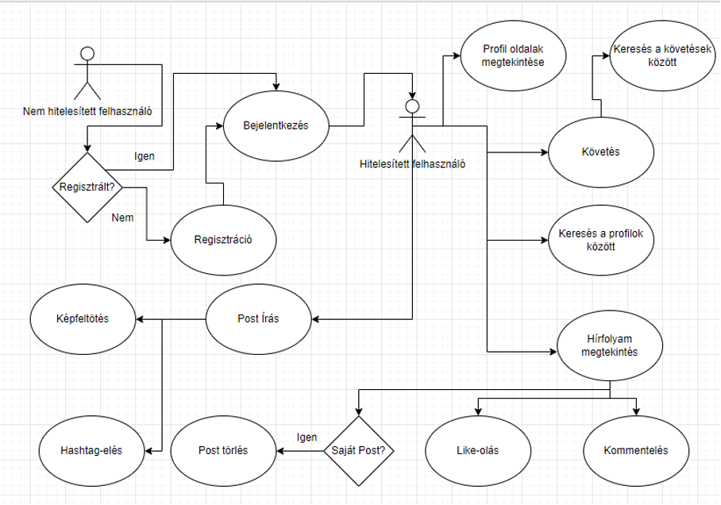

A diagramm alapján minden egyértelmű esetleges kérdés esetén a kapcsolatot fel lehet venni velünk.

## Architektúra

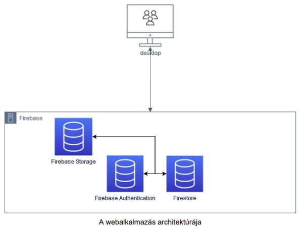

# Firebase

## Authentikáció

Előnye, hogy a sima email/password páros mellett még Provider-en keresztól is lehetőséget biztosít a felhasználók számára a bejelentkezésre és regisztrációra is.

 Mellékesen nem tárol a felhasználóról semmilyen szenzitív adatot mint például egy jelszót plain text-ben titkosítja.

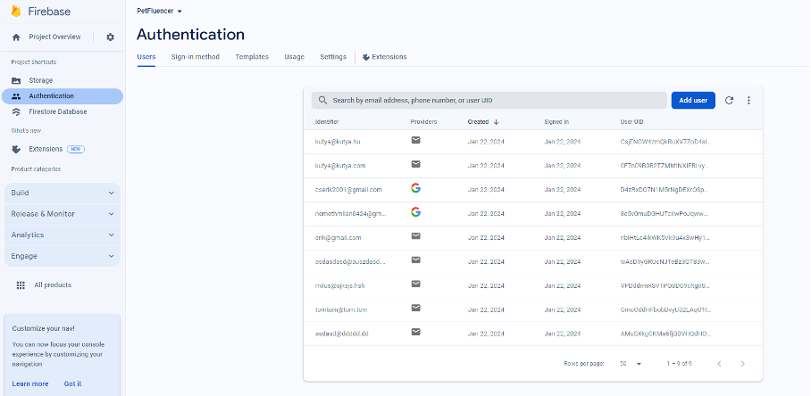

## Cloud Firestore

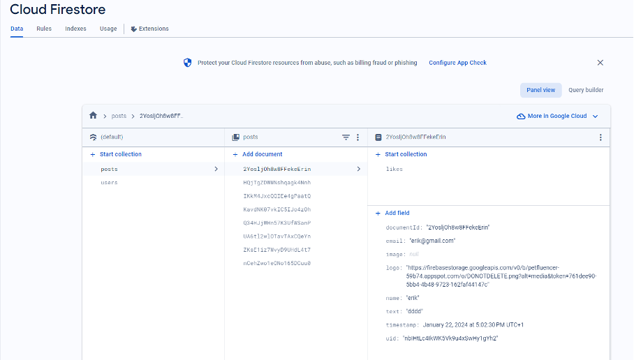
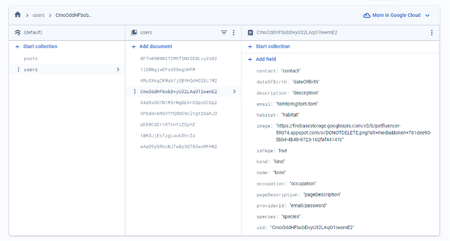

## Storage

A Firebase lehetőséget nyújt fájlok tárolására is így ezt használtuk képfeltöltésre.

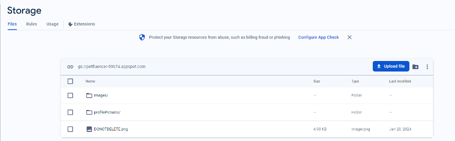

# Frontend technológiák

# useState

Egy React hook (továbbiakban: horog), amelyet a funkcionális komponensben használunk, hogy állapotokat tároljuk és kezeljük.

 A useState segítségével a komponensünk képes reagálni a felhasználói interakciókra vagy más eseményekre. Lehetővé teszi, hogy az alkalmazásunk dinamikus és interaktív lehessen

# useEffect

React hook, amelyet funkcionális komponensekben használunk. Ez a hook lehetővé teszi számunkra, hogy mellékhatásokat hozzunk létre a komponensek életciklusában, például adatlekérések, eseménykezelők vagy más olyan műveletek végrehajtásával, amelyek nem közvetlenül kapcsolódnak a komponens megjelenítéséhez.

# React Context

A React Context API egy eszköz a React alkalmazásokban, amely lehetővé teszi a globális adatok megosztását a komponensek között, anélkül, hogy azok a komponensfa mélyén át kellene passzolni az adatokat. 

Ez a megközelítés különösen hasznos olyan alkalmazásokban, ahol a komponensek nagy mélységben vannak egymás alatt, és az adatoknak több komponensen kell áthaladniuk.

# react-router-dom

A react-router-dom egy React alapú könyvtár, amely lehetővé teszi a dinamikus, kliensoldali útvonalvezérlést React alkalmazásokban. A könyvtár egy könnyen használható API-t biztosít, amely segít az alkalmazásodnak dinamikusan navigálni és az URL-alapú útvonalakra reagálni.

# Képek az oldalról

 ## Fő oldal
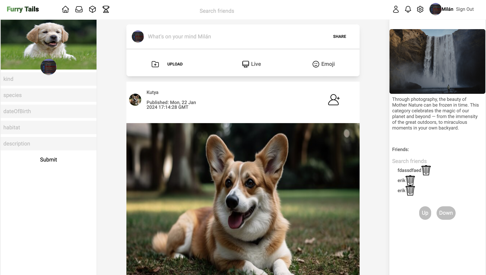
## Regisztráció

## Bejelentkezés
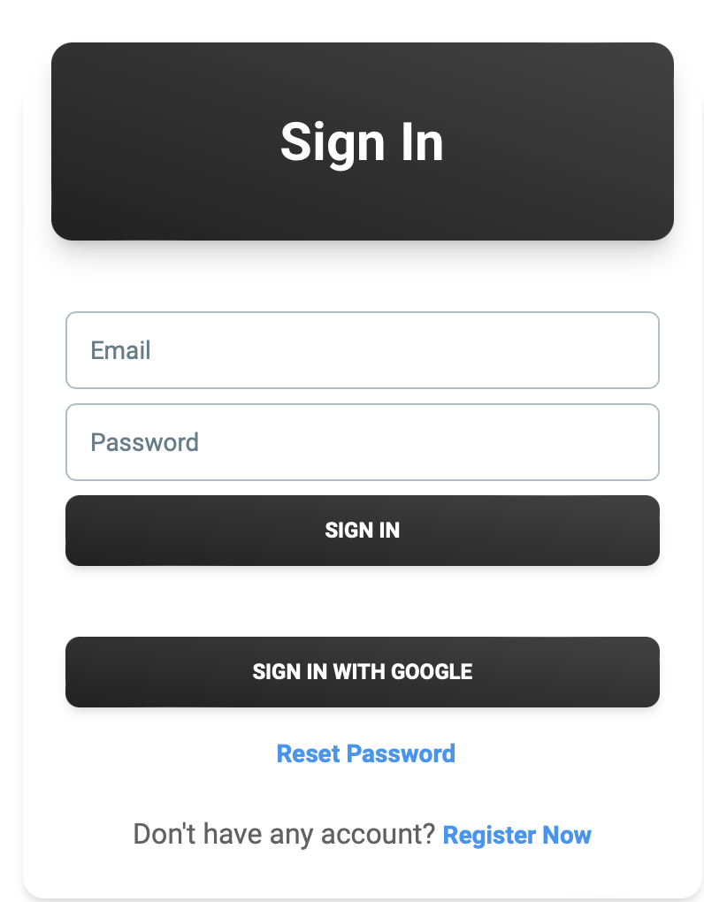
## Kereső
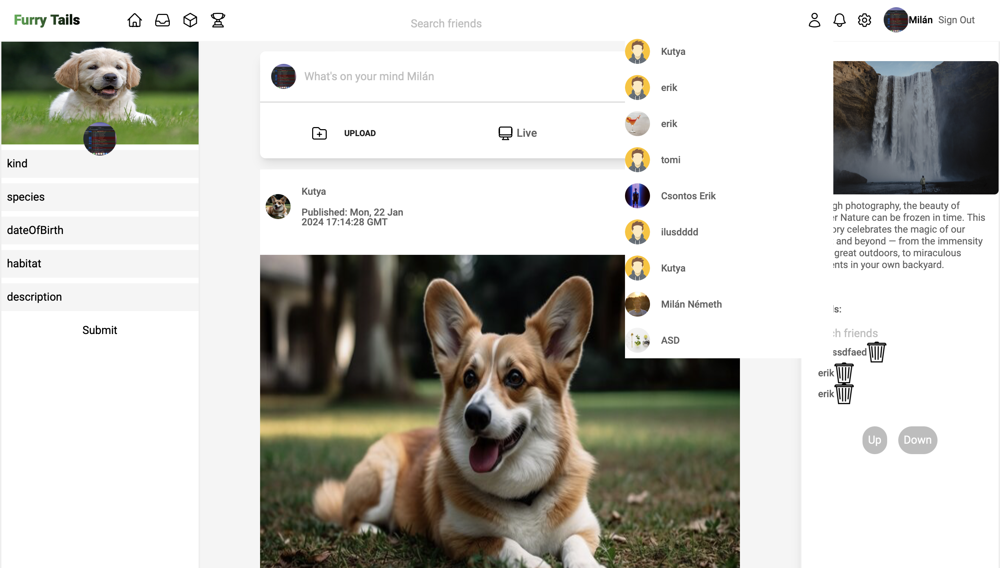
## Barátok
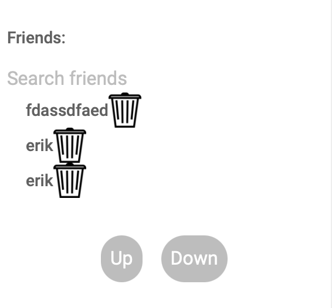
## Profil
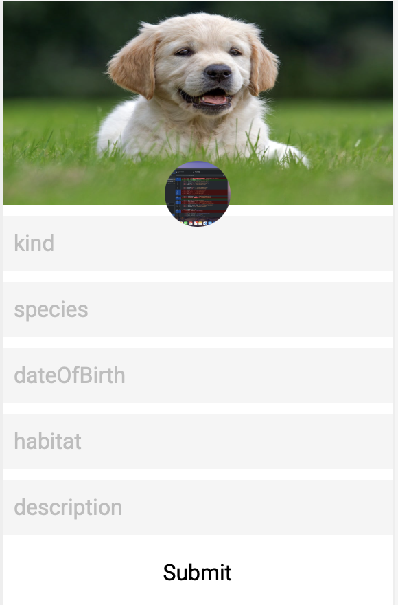
## Elfelejtett jelszó
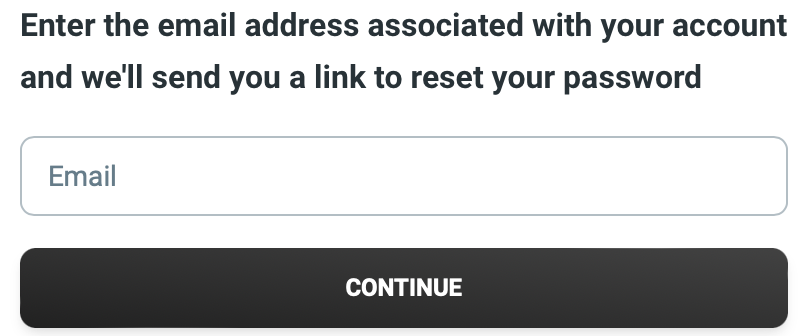

# Fejlesztő eszközök

## Visual Studio Code

Visual Studio Code (VS Code) egy ingyenes, nyílt forráskódú kódszerkesztő és fejlesztői környezet, amelyet a Microsoft fejlesztett ki és támogat. A VS Code egy könnyű, gyors és kiterjeszthető eszköz, amelyet a fejlesztők széles körében használnak különböző programozási nyelvekkel dolgozva.

## GitHub

GitHub egy webes alapú platform és szolgáltatás, amely a verziókezelés, a forráskód tárolás és az együttműködés támogatására szolgál. 

A GitHubot széles körben használják fejlesztők, szoftvertervezők és csapatok a projektjeik kezelésére és nyomon követésére.

# Továbbfejlesztési lehetőségek

A webalkalmazásokon szinte, végtelen de biztosan rengeteg lehetőség van. Például, rakhatunk bele hirdetési lehetőséget, anyagi támogatás lehetőséget, chat funkciót, térképet.

# Irodalomjegyzék

[ChatGPT](https://chat.openai.com/) - hibamegoldásba segített

[react.dev](https://react.dev/) - react dokumentáció

[Stack Overflow](https://stackoverflow.com/) - más megoldások kutatása

[w3schools](https://www.w3schools.com/) - példakódok

[Firebase dokumentáció](https://firebase.google.com/docs) - BaaS rendszer kezelésre

Dokumentációhoz felhasznált:

https://hu.wikipedia.org/wiki/GitHub
https://hu.wikipedia.org/wiki/Visual_Studio_Code
https://en.wikipedia.org/wiki/Firebase
https://en.wikipedia.org/wiki/React_(software)
