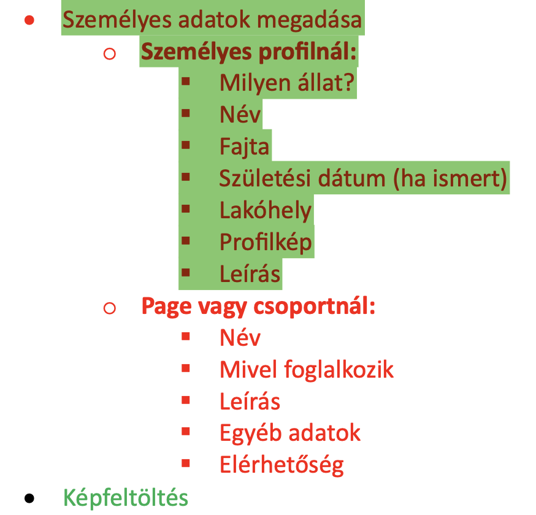

# Petfluencer social media webapplikáció megvalósítása egy választott fullstack megoldással

Feladatvezető: Koncz Adrienn

**Feladatok részletezése I.**

- Regisztráció 
- Személyes profil 
- Page profil
- Bejelentkezés
- Új jelszó igényzés
- Képfeltöltés
- Like-olás
- Kommentelés
- Egymás ismerősnek jelölése vagy követése

**Feladatok részletezése II.**

- Design-os frontend
- Kereső (profilok között)
- Hastag-elés lehetősége
- Személyes adatok megadása
- Személyes profil esetében
- Milyen állat?
- Név
- Fajta
- Lakóhely
- Profilkép

**Feladatok részletezése III.**

- Születési dátum
- Leírás
- Page profilnál
- Név
- Mivel foglalkozik
- Leírás
- Egyéb adatok
- Elérhetőség

**Munkafolyamat**

- Tervezés
- Milyen megoldások, milyen adatbázist használjunk stb.
- A közösségi média app vázlatának megalkotása
- Váz elkészítése
- Adrienn észrevételeinek a javítása, megvalósítása
- Tesztelés
- Dokumentáció készítés
- Bemutató készítés

**A feladatot teljesítők**

Csontos Erik

Kende Péter

Leyrer Balázs Valentin

Németh Milán

